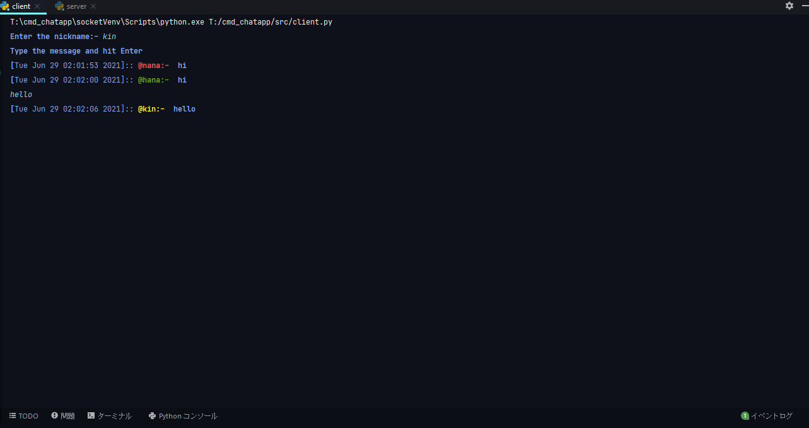
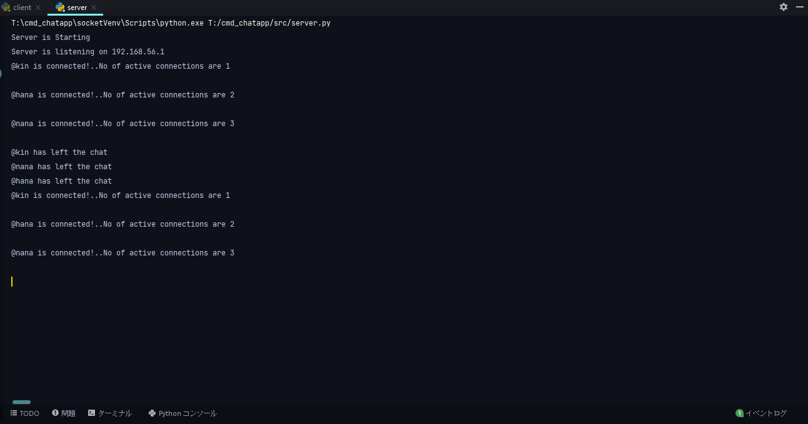

# Command-Line Chat Application
***
A Simple command line chat application using python and web sockets.

Client Side         |  Server Side
:-------------------------:|:-------------------------:
  |  

---

## Project Dependencies
1. Colorama

---
## Normal Setup
- Basic System Requirements
> Python >= 3.9
> 
> virtualenv >= 16.0.0

- Run these command to run the project on your local machine
> python -m venv socketVenv
> 
> Activate the Virtual Env
> 
> clone the project
> 
> cd src
> 
> pip install -r requirements.txt
> 
>python server.py
> 
> python client.py
